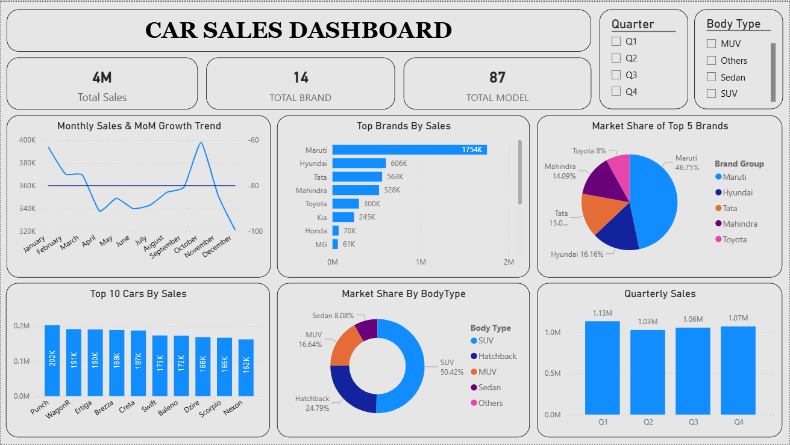

### 🚗 Car Sales Analysis Project (India – 2024)

#### 📌 Project Overview -

* This project is an end-to-end data analytics case study focused on analyzing car sales performance in India for the year 2024.
* It demonstrates a complete analytics workflow — starting from raw data analysis and querying, progressing through exploratory data analysis, and concluding with an interactive business dashboard.
* The project is designed to showcase real-world data analyst skills, including data querying, analysis, visualization, and business storytelling.

#### 🧩 Project Structure -

##### The project is divided into four logical layers:

1. Excel – Raw dataset \& initial inspection
2. SQL – Business-focused querying and KPI analysis
3. Python – Exploratory Data Analysis (EDA) \& validation
4. Power BI – Interactive dashboard \& insights delivery

#### 📂 Dataset Description -

##### The dataset contains monthly car sales information across multiple dimensions:

###### Key Columns:

* Make (Brand)
* Model
* Month
* Quarter
* Sales
* Total Sales
* Segment
* Body Type
* MoM % (Month-on-Month Growth)
* YoY % (Year-on-Year Growth)

The data represents a denormalized reporting-style dataset, similar to what analysts encounter in real business environments.

#### 🧰 Tools \& Technologies Used -

1. ###### Data Analysis \& Querying

* Excel
* SQL (MySQL / phpMyAdmin)

###### 2\. Data Analysis \& Visualization

* Python
* Pandas
* Matplotlib
* Seaborn

###### 3\. Power BI Desktop

* DAX
* Data modeling
* Interactive visuals

#### 🔍 SQL Analysis (Business Querying Layer) -

###### Purpose : To strengthen core SQL analytics skills using real-world sales data.

###### Key SQL Concepts Used :

* SELECT, WHERE
* ORDER BY, LIMIT
* Aggregate functions (SUM, AVG, COUNT)
* GROUP BY \& HAVING
* Subqueries
* Window functions (RANK)
* Market share calculations
* MoM \& YoY growth analysis

###### Sample Business Questions Answered :

* What are the top-performing car brands and models?
* How do sales vary month-wise and quarter-wise?
* Which segments and body types contribute the most?
* Which models show high sales but weak growth?
* How is market share distributed across brands?

#### 🐍 Python Exploratory Data Analysis (EDA Layer) -

###### Purpose : To explore, validate, and visually analyze sales data before dashboarding.

###### Key EDA Steps :

* Data loading and cleaning using Pandas
* Standardizing month order for time-series analysis
* Aggregation and grouping for insights
* Visual storytelling through charts

###### 

###### Visual Analyses Performed :

* Monthly sales trends
* Sales by segment
* Market share by brand
* Top \& bottom performing models
* Sales distribution and skewness
* Average sales by body type

###### Key Insights :

* Sales are highly skewed toward a few top models
* Clear seasonality patterns across months
* SUVs dominate overall sales contribution
* Strong disparity between top and bottom models
* A few brands control a large portion of market share

#### 📊 Power BI Dashboard -

###### Dashboard Highlights :

###### 

1. ###### KPI Cards:

* Total Sales
* Total Brands
* Total Models

###### 2\. Charts:

* Monthly Sales \& MoM Growth Trend
* Top Brands by Sales
* Market Share of Top 5 Brands
* Top 10 Cars by Sales
* Market Share by Body Type
* Quarterly Sales Performance

###### 

###### 3\. Interactivity:

* Quarter slicer
* Body Type slicer
* Dynamic filtering across all visuals

###### 4\. Data Modeling Best Practices -

* Month and Quarter lookup tables
* Numeric sort keys for correct time ordering
* Star-schema-inspired relationships
* Avoidance of circular dependencies

###### 5\. Design Focus -

* Clean and minimal layout
* Consistent color theme
* Business-friendly visuals
* Emphasis on clarity over decorative charts

#### 🎯 Project Objective -

To transform raw car sales data into meaningful business insights and present them through clear, interactive, and decision-ready dashboards, simulating a real-world data analyst workflow.

#### 🏁 Conclusion -

###### This project demonstrates strong capabilities in:

* SQL-based business analysis
* Python exploratory data analysis
* Power BI data modeling and visualization
* End-to-end analytics thinking
* Data storytelling for business users
* It is suitable for portfolio presentation, GitHub showcase, and data analyst interviews.

#### 👤 Author -

**Atharva Bhusange**

**Aspiring Data Analyst**

**Skills: Excel | SQL | Python | Power BI | Data Visualization | Business Analytics**

